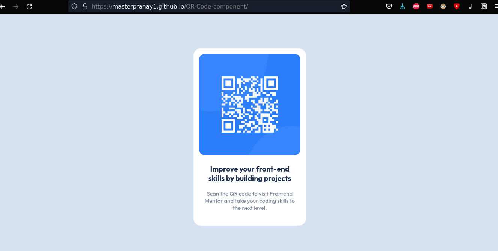
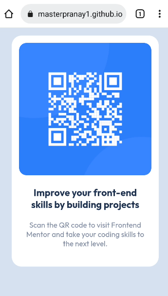

# Frontend Mentor - QR code component solution

This is a solution to the [QR code component challenge on Frontend Mentor](https://www.frontendmentor.io/challenges/qr-code-component-iux_sIO_H). 

 

This is a simple single page app which was solved in collaboration on replit.
Click Here: [Live Link](https://masterpranay1.github.io/QR-Code-component/)

- [Overview](#Overview)
- [Screenshots](#Screenshots)
- [Built With](#Built-With)
- [Platform Used](#Platform-Used)
- [Features](#Features)
- [My Learning](#My-Learnings)
- [Authors](#Authors)

## Overview

This webpage was made on [Replit](replit.com) in order to explore its collaborative feature. And for This I ( Pranay Raj ) and Vaibhav decided to take a Front End Mentor simple challenge.

## Screenshots

#### Desktop

#### Mobile

## Built With

- Html5
- Css3

## Platform Used

- [Replit](Replit.com) ( for collaborative feature )

## Features

- Responsive
- Clean UI
- Clean Code 🧼
- Css Variables

## My Learnings

1. RepltIt
2. Css 

## Authors

  Hey!! I am Pranay Raj and my college friend [Vaibhav Kumar Singh](https://vaib.carrd.co). We love making cool projects and contributing to open source.  
  Feel Free to create a issue or to contribute to this project. 💘